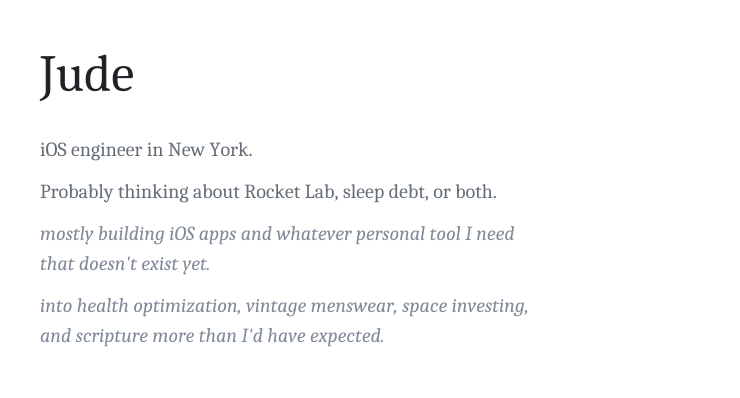

<picture>
  <source media="(prefers-color-scheme: dark)" srcset="readme-header.svg" style="width:100%">
  <source media="(prefers-color-scheme: light)" srcset="readme-light.svg" style="width:100%">
  
</picture>
